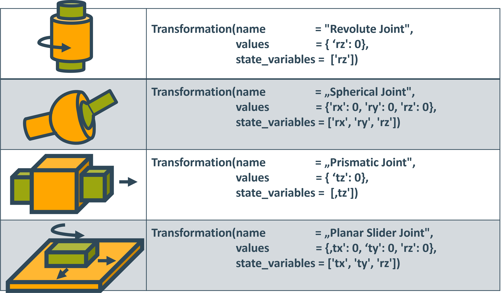
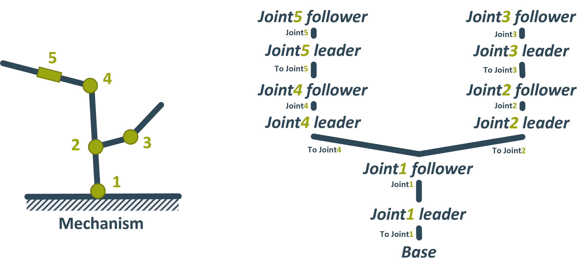
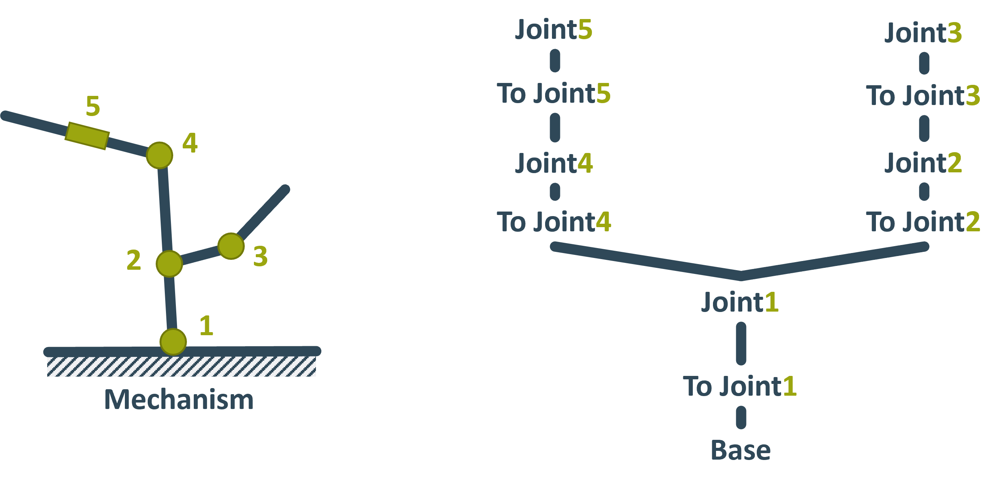
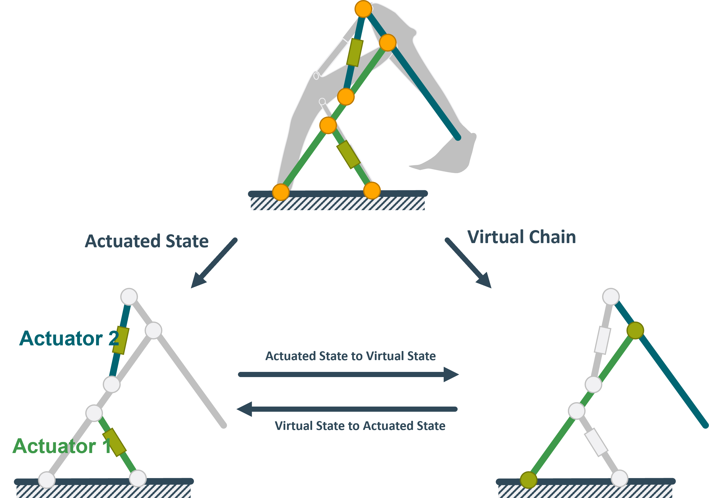
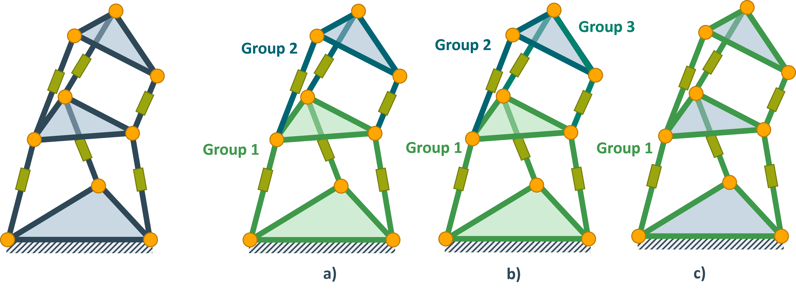
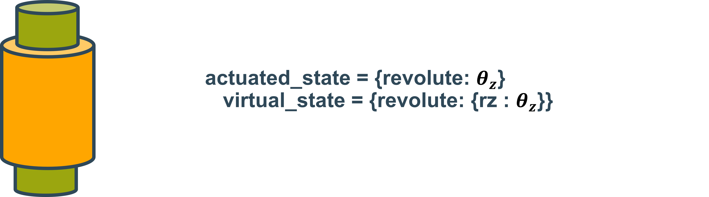
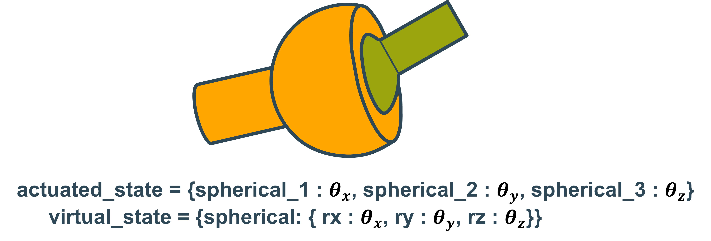
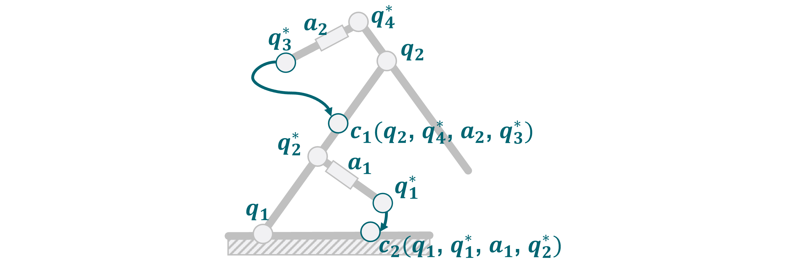
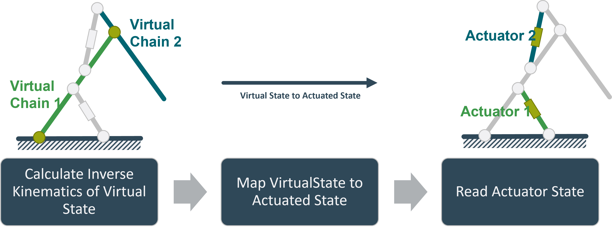

######################
How TriP models Robots
######################

TriP models robots using the :class:`Robot` class.
A robot object is made up of :class:`Transformation` and :class:`KinematicGroup` objects.
The :class:`KinematicGroup` objects are used to model closed chains.

The following sections will explain the :class:`Transformation`, :class:`KinematicGroup` and :class:`Robot` objects in more detail.
It is advised to read these sections before using them to model robots.

The last section also explains how Kinematic Solvers work.

****************
Transformations
****************

A Kinematic model is made up of Coordinate systems.
These coordinate systems are connected by transformations.

TriP implements its own :class:`.Transformation` class.

One can distinguish between static transformations and dynamic transformations.
Dynamic transformations change depending on an internal state thereby modeling the joints of a mechanism.

.. TODO zuerst mehr auf Struktur der Transformation class eingehen!

The :class:`.Transformation` class has an attribute that manages the internal state.

Transformation Descriptions
===========================

In general, states can influence the transformation in arbitrary ways.
Yet robotics uses several standard conventions.

The :class:`.Transormation` class currently supports the following conventions:

* translation with Euler angle rotation
* translation with quaternion rotation
.. * Denavit Hartenberg 


Translation with Euler Angles rotation
--------------------------------------
This convention is perhaps the most natural and intuitive.
In this convention, the transformation is specified using 6 parameters `[tx ty tz rx ry rz]`.
These parameters have the following interpretation:

========== ===============================================
parameter  interpretation
========== ===============================================
tx         moves the coordinate system along the x-axis
ty         moves the coordinate system along the y-axis
tz         moves the coordinate system along the z-axis
rx         rotates the coordinate system around the x-axis
ry         rotates the coordinate system around the y-axis
rz         rotates the coordinate system around the z-axis
========== ===============================================

.. important::
    In this convention, rotation is always applied before translation.

    The Euler angles follow the `XYZ` convention.
    This means that the transformation first rotates around x, then around y, and lastly around z.
    This convention is also called Roll, Pitch, and Yaw. Here rx=Roll, ry=Pitch, and rz=Yaw.


This transformation is captured by the following transformation matrix:

.. math::
    \begin{pmatrix} \cos{rz}\cos{ry} & \cos{rz}\sin{ry}\sin{rx} - \sin{rz}\cos{rx} & \cos{rz}\sin{ry}\cos{rx} + \sin{rz}\sin{rx} & t_x \\
                    \sin{rz}\cos{ry} & \sin{rz}\sin{ry}\sin{rx} + \cos{rz}\cos{rx} & \sin{rz}\sin{ry}\cos{rx} - \cos{rz}\sin{rx} & t_y \\
                    -\sin{ry}        & \cos{ry}\sin{rx}                            & \cos{ry}\cos{rx}                            & t_z \\
                    0                & 0                                           & 0                                           & 1 \end{pmatrix}

The definition of joints in this convention is very straightforward, below is a sample list of different joints:



Note that while all non specified parameters are assumed to be zero, the value of each `state_variable` still has to be supplied.

Translation with Quaternion rotation
------------------------------------
Quaternions are an alternative four-dimensional description of rotation.
They have many advantages compared to Euler angles, which are explained `here <https://en.wikipedia.org/wiki/Quaternion>`_ .
However, they trade these advantages for an intuitive interpretation.

========== ===============================================
parameter  interpretation
========== ===============================================
tx         moves the coordinate system along the x-axis
ty         moves the coordinate system along the y-axis
tz         moves the coordinate system along the z-axis
qw         first quaternion, also called a.
qx         second quaternion, also called b.
qy         third quaternion, also called c.
qz         fourth quaternion, also called d.
========== ===============================================


The corresponding matrix is:

.. math::
    \begin{pmatrix} 1-2(q_y^2+q_z^2) & 2(q_xq_y-q_zq_w) &  2(q_xq_z + q_yq_w) & t_x \\
                    2(q_xq_y + q_zq_w) & 1-2(q_x^2+q_z^2) &  2(q_yq_z - q_xq_w) & t_y \\
                    2(q_xq_z-q_yq_w)   & 2(q_yq_z+q_xq_w) &  1-2(q_x^2+q_y^2)  & t_z \\
                    0                & 0                  & 0                   & 1 \end{pmatrix}


.. important:: 
    The matrix only describes a rotation if all quaternions are normalized, meaning :math:`qw^2+qx^2+qy^2+qz^2=1`.
    Since the current inverse kinematics solver does not support constraints this means that quaternions are not supported when calculating inverse kinematics.

..
    Denavit Hartenberg
    ------------------
    The Denavit Hartenberg is a popular although limited description format.
    It requires only 4 parameters to describe a transformation.
    This makes the transformation numerically efficient for inverse kinematic solvers.

    ========== ===============================================
    parameter  interpretation
    ========== ===============================================
    theta      rotates the coordinate system around the z-axis
    d          moves the coordinate system along the z-axis
    a          moves the coordinate system along the x-axis
    alpha      rotates the coordinate system around the x-axis
    ========== ===============================================

    .. important::
        While these parameters perform the same functions as in the first convention the transformations are applied in a different order.
        Namely, the system first rotates around the z-axis, then it moves along it, then it moves along the x-axis, and then it rotates around it.

        The Denavit Hartenberg formulation only works for robots with only one branch from start to finish.
        This includes most robotic arms but excludes for example humanoid robots as each limb is a separate branch. For more information see the next subsection.


    The Denavit Hartenberg transformation is captured by the following matrix:

    .. math::
        \left(\begin{array}{cccc}
        {\cos \theta} & {-\sin \theta \cos \alpha} & {\sin \theta \sin \alpha} & {a \cos \theta} \\
        {\sin \theta} & {\cos \theta \cos \alpha} & {-\cos \theta \sin \alpha} & {a \sin \theta} \\
        {0} & {\sin \alpha} & {\cos \alpha} & {d} \\
        {0} & {0} & {0} & {1}
        \end{array}\right)


Transformation trees
====================

To fully specify the kinematic model of a robot not only the transformations are needed but also
how they are connected.
This is described by the so-called transformation tree.
Conventionally nodes of this tree describe coordinate frames while its edges describe transformations.
An example can be seen down below:



Here the cursive graph nodes are coordinate frames while the edges are the transformations between them.
Since TriP only models transformations and not coordinate frames in TriP the name of a coordinate frame is synonymous with the name of the transformation leading to it.
This leads to the following simplified transformation tree:



In this tree the edge and the node it leads to refer to the transformation.
TriP builds this simplified transformation tree by specifying the parent of each transformation.
The parent is in this case the transformation that preceded the current transformation.
For the example transformation tree this would look like this:
::
    to_joint_1 = Transformation(name="To Join1")
    joint_1    = Transformation(name="Joint1",values={'ry': 0},state_variables=['ry'],parent=to_joint_1)

    to_joint_2 = Transformation(name="To Joint2",values={'tx':1},parent=joint_1)
    joint_2    = Transformation(name="Joint2",values={'ry': 0},state_variables=['ry'],parent=to_joint_2)
    to_joint_3 = Transformation(name="To Joint3",values={'tx':1},parent=joint_2)
    joint_3    = Transformation(name="Joint3",values={'ry': 0},state_variables=['ry'],parent=to_joint_3)

    to_joint_4 = Transformation(name="To Joint4",values={'tx':1},parent=joint_1)
    joint_4    = Transformation(name="Joint4",values={'ry': 0},state_variables=['ry'],parent=to_joint_4)
    to_joint_5 = Transformation(name="To Joint5",values={'tx':1},parent=joint_4)
    joint_5    = Transformation(name="Joint5",values={'ry': 0},state_variables=['ry'],parent=to_joint_5)

.. important::
    Transformations with no parent are considered connected to the base Frame. Since for most robots, this is where they are connected to the floor this frame is also called Ground.
    This can be seen in transformation ```to_joint_1```. Note that strictly speaking this transformation is necessary since its transformation is an identity matrix.
    It is only included for clarity.

The transformation tree building concept does not work if more than one transformation leads to the same frame.
Here one would have to distinguish between the transformations leading to the frame and the frame itself.
Such a situation is referred to as a closed kinematic chain, the next section will explain how they are modeled in TriP.

****************
Kinematic Groups
****************

Most kinematic libraries rely only on transformation objects because they only model open chains.
An example for this is `IKPY <https://github.com/Phylliade/ikpy>`_ . 
In an open chain, the position and orientation of a coordinate system depend only on one transformation from its parent.


But, consider the excavator arm below:

.. image:: images/excavator_arm.png
 :alt: excavator_arm

.. TODO describe joint drawing conventions

In this example, multiple coordinate systems have more than one parent since the transformations form a loop.

Such a loop is called a closed kinematic chain.

Classically closed chains are modeled using an algebraic closure equation :math:`g(q) = 0`.
The closure equation couples all joint states :math:`q` so that multi transformations leading to the same frame all agree on the state of the frame.

In practice, this is computationally expensive and often entirely unnecessary.

.. important::
    To simplify the system one could treat the system as if the hinges of the excavator's arm were directly actuated.

    This simplified virtual chain contains no closed loops and thus standard kinematics algorithms can be used to compute forward or inverse kinematics.

    To get the solution of the real excavator, one simply has to convert between the state of the hinges and the state of the hydraulic cylinders.
    
    This can be done using some kind of mapping function based on trigonometry.


TriP embraces this mapping approach and implements it using the :class:`.KinematicGroup` class.
A :class:`.KinematicGroup` is made up of a `virtual_chain`, an `actuated_state`, and two mappings.
The mappings convert between the state of the `virtual_chain`, called `virtual_state`, and the state of the actuated joints called `actuated_state`.



.. important::
    The virtual_chain has to be a single open chain without branches.
    The reasons for this will be discussed in the next section

divide a robot into groups
==========================
In the example above the excavator is modeled as a single group.
However, it is also possible to divide the excavator into multiple groups.
These groups can then be combined just like transformations.
Multiple smaller groups have two advantages over a single large group:

For one it improves modularity, making it easier to reuse assembly parts.

But more importantly, it reduced computational cost.
To keep virtual and actuated state consistent mapping has to be called every time part of one state changes.
A single group mechanism would mean updating every state.
This problem is especially bad for branching mechanisms.
Consider a four-legged robot, setting the actuator of one leg would then mean updating all four legs.
To prevent this problem outright the virtual chain can not contain branches.


In summary, groups should be defined as small as possible.
Small in this case refers to the number of actuators that have to be grouped.
The minimum size is defined by the closed chains.
Consider the following mechanism



Grouping a) and c) are valid groups, with a) being more performant. 
However the Grouping in b) is not valid. 
The reason is that the state of the top platform depends on the state of all three green prismatic joints.

.. TODO noch auf offene ketten eingehen, warum sind die keine Gruppen?


These considerations lead to the following guidelines for building hybrid robots:

.. important::
    Every closed chain should be modeled by a Group. 
    Every open chain should be modeled by Transformations.  
    Se the following robots as an example:

    .. image:: images/hybrid_chain_taxonomy_groups.png
        :alt: group_partitoning


The excavator has two actuated states and two virtual states.
These are the lengths of hydraulic cylinders :math:`a_1`, :math:`a_2` and the arm angles :math:`q_1`, :math:`q_2`.
Since each cylinder length :math:`a_i` controls one arm angle :math:`q_i`, the excavator can be divided into two groups.
These are visualized by the green and blue parts respectively.

The mappings for each group can be calculated using trigonometry:

.. image:: images/geometric_mapping.png
    :alt: geometric_mapping

The full code for the excavator looks like this:

.. literalinclude:: ../../src/trip_robots/excavator_rr.py
   :language: python
   :linenos:
   :lines: 13-75


actuated state vs virtual state
===============================
If one looks at the code above one can see that the dictionary values of the actuated state in lines 26 and 36 are float values, 
while the values of the virtual states in lines 32 and 39 are dictionaries.

This difference is because virtual states always specify convention parameters of a :class:`Transformation`.
Actuated values on the other hand are not associated with a Transformation and thus don't adhere to transformation conventions.

This is an important difference to keep in mind when dealing with both states.
Below are a few examples of joints and how their actuated and virtual states would differ.







Using closure equations
=======================
While direct mappings are always preferable it is not always possible to find a direct function.
In this case, one can always resort to the closure equation.
Since TriP is based on mappings the closure equation is used to set up mapping functions that solve the closure equation.
For the mapping from actuated state to virtual state, the actuated states are fixed and the virtual states calculated.
Likewise, for the reverse mapping, the virtual state is fixed while the actuated states are calculated.

The setup of the closure equation will require extra transformations.
This can be done by building a full open chain or for simple chains by directly setting up the transformation matrices using the Utility submodule.
In this case of the excavator, the following joints can be defined:



The solving of the closure equation can be performed by casadi, which TriP also uses for inverse kinematics calculations:

.. literalinclude:: ../../src/trip_robots/excavator_rr.py
   :language: python
   :linenos:
   :lines: 78-143

.. _virtual_chain_reference_label:

Defining virtual chains
=======================
In the vast majority of cases, the specification of the virtual chain is straightforward.
One simply uses a single chain of transformations that goes from one end of the group to the other.
However, in some cases, this can lead to unintended or suboptimal results.

As a simple example of this problem, think of the excavator arm from above.
Assuming that it had a spherical joint at the elbow, the system would still not be able to move any differently.
However, the virtual open chain which neglects the hydraulic cylinders would suddenly behave much differently.

An inverse kinematics solver might now try to find open chain configurations that are not possible with the full mechanism.


.. warning::
    Since TriP currently does not support Joint limits, it can not detect which open chain configurations are not possible.
    This can lead to solvers failing outright.

This problem can be avoided by designing a custom virtual open chain.
In the case of the excavator this is very simple, just substitute the spherical joint with a revolute joint.
For more complicated robots this might be more complex, a general rule of thumb is:

.. important::
    The virtual open chain should offer the same degrees of freedom as the full mechanism.
    Ideally, the correspondence between virtual joints and actuated joints should be as simple as possible.


******
Robots
******

The Robot class is the centerpiece of TriP, they encapsulate  :class:`.Transormation`  and :class:`.KinematicGroup` objects of a Robot.
This causes some problems.
Groups distinguish between actuated_states and virtual_states while for a transformation these are the same.´

.. important::
    To solve this problem Transformations are internally converted into groups.
    The actuated state of a transformation follows the naming convention `NAME_KEY` 
    where `NAME` is the name of the :class:`.Transformation` and `KEY` is a key for the state of the transformation.
    The full actuated state of a robot can be returned using the `get_actuated_state` method.

For robots without closed chains, both the virtual_state and the actuated_state can be used interchangeably.
We advise nevertheless to use the actuated_state whenever possible as a general convention.

End Effectors
=============

The :class:`.Robot` class offers the same functionality as the Group object at a more abstract level.
Additionally, it supports end effectors.
In robotics, an end effector is conventionally a device at the end of a robotics arm which interacts with the environment.
Kinematically and more, generally speaking, it is a coordinate frame whose position and orientation is of special interest.
This might be because it holds a tool, or because it specifies a foot position or maybe it just holds a sensor.

In any case, end effectors are coordinate frames for which we might want to compute forward or inverse kinematics.
Since for open chains frames and the transformations leading to them are synonymous an effectors can be any frame resulting from a transformation of a robots virtual_chain.
Remember since the robot is comprised of groups it's virtual open chain is a concatenation of the virtual_chains of each group.

The :class:`.Robot` class offers the `get_endeffectors` method for ease of use which returns the names of all possible end effector frames.

Symbolic Representations
========================

The robot class is capable of generating symbolic representations of end effector kinematics.
This means it can describe the state of and end effector frame as a mathematical function :math:`\tilde{p}(\tilde{q})` whose input is the virtual state :math:`\tilde{q}`.

This is handy for several reasons:

- It allows for quick calculations of the end effector position without needing matrix multiplication at every step
- It allows automatic mathematical derivation to calculate the Jacobi matrix and generally analyze the virtual chain
- It allows the setup of mathematical solvers which can compute the inverse kinematics for a given end effector.

Generally, the first point is not needed as the forward kinematics is quite fast on its own and can be called using the `forward_kinematic` function given an end effector and a robot object.
However, if speed is the issue, the casadi library which is used for the symbolic representation is capable of generating C code from such a function object.
This can be used to further speed up code executions or calculate the kinematics on an embedded device.

The main advantages, however, are the second and the third points which are related seeing that most numerical optimization requires the computation of gradients.
Casadi features fast algorithmic differentiation (a powerful hybrid between numerical differentiation and analytic differentiation used in many machine learning solutions).
This allows the fast calculations of gradients and Jacobi matrices.

As such TriP can also be used to do kinematic analysis for open chains.
Note that it does not support closed chains because the mapping functions don't have to be casadi objects.
However if one does use casadi like functions TriP can also be used to analyze hybrid chains.

In general, the symbolic representation returns a casadi object on which the full`casadi feature pallet can be used.
This includes the setup of numerical solvers which are used to calculate the inverse kinematics.


Forward kinematics
==================

The calculation of forward kinematics is done using the `forward_kinematic` function.
The general procedure can be seen in the image below:

.. image:: images/forward_kinematics_procedure.png
 :alt: inverse_kinematics_procedure

The forward kinematics of the virtual_chain are in this case calculated by multiypling the transformation matrices of the virtual_chain together.
This results in a 4x4 transformation matrix describing the state of the end effector.

*******
Solvers
*******

Solvers are objects which calculate the inverse kinematics for a given :class:`.Robot` and end effector.
The reason they are not functions like the forward_kinematic functions is that the generation and setup of a casadi solver object is the biggest performance bottleneck.
To circumvent this, solver classes generate and store casadi solver objects for a given robot and end effector.
Using casadis framework it is then easily possible to implement different types of solving algorithms.

TriP currently only has one type of solver object called :class:`.SimpleInvKinSolver` which will be further explained shortly.
However it is also possible to write your own solver classes, all one has to do is implement the `solve_virtual` and `solve_actuated` 
functions which return the virtual and actuated state respectively given a desired end effector state and an optional initial solver tip.

SimpleInvKinSolver
==================

The :class:`.SimpleInvKinSolver` is as the name implies a rudimentary solver whose general procedure can be seen in the image below:



First, the system tries to find a virtual state which results in the end effector being as close as possible to the target.
This is done using a casadis NLP solver using auto-generated jacobian and hessian matrices.

In the next step, the system calls the internal mapping functions of the robot to convert the virtual_state into an actuated_state.

.. warning::
    This sequential approach is not capable of handling virtual_states for which no actuate_state can be found. 
    In this case, the solver simply fails.
    To prevent this, suitable starting values for the solver can be supplied and the virtual_chain can be set up to minimize the chance of this happening.
    See section :ref:`virtual_chain_reference_label` for reference.


