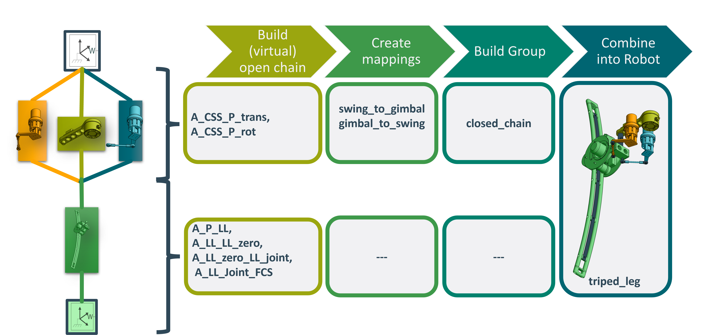
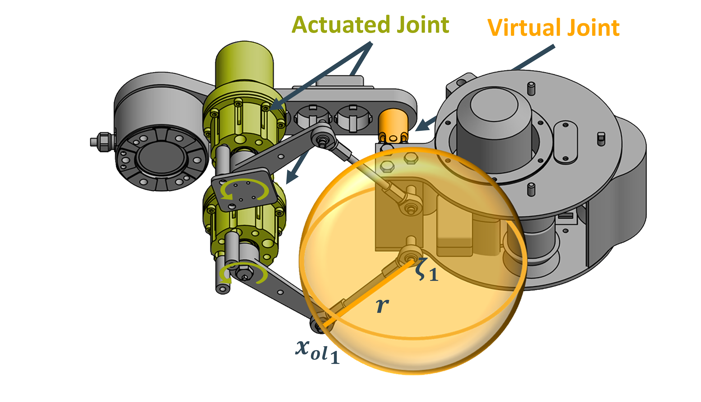

Tutorials
************

.. toctree::
   :hidden:
   

   
Building a Robot Model
======================

Building a robot is the first step in using the functionality of TriP.
This Tutorial will show how to buil a leg of the `TriPed robot  <https://triped-robot.github.io/docs/robot/>`_  shown below:

.. image:: https://user-images.githubusercontent.com/22688144/124489566-6d70f000-ddb1-11eb-9f57-6a2d9e374fcc.png?raw=true
    :alt: triped

Here each leg was highlighted in a different color.
More information about the triped legs can be found `here <https://triped-robot.github.io/docs/legs/>`_ .

The first step in setting up a robot is identifying the kinematic groups.
This is requires some knowledge about kinematic structures, but as a generale rule, each time multiple moving parts converge in a single location they should be part of a group.
Specifically they are in all likelyhood part of something called a closed kinematic chain.
The name is derived from the fact that the moving parts form closed loops.
A good first step when dividing a robot into groups is first identifying these closed chains.

These closed chains will either be connected directly to each other or using a series of other moving parts.
Such a series is called a open kinematic chain.
Each open chain is also considered a group.

In the case of the TriPed the following chains can be identified:

.. image:: images/triped_hybrid_chain.png
    :alt: triped-hybrid_chain

This in turn means that the leg of the TriPed is made up of two kinematic groups.

Once each group has been identified the group construction worklow goes like this:

Building virtual open chains
----------------------------

In the case of the TriPed two virtual open chains have to be set up, one for each group.
According to the kinematic transformations described `here <https://triped-robot.github.io/docs/kinematics/>`_ the virtual open chain of the closed chain can be defined using:
::
    
    A_CSS_P_trans = Transformation(name='A_CSS_P_trans',
                                   values={'tx': 0.265, 'tz': 0.014})

    A_CSS_P_rot = Transformation(name='A_CSS_P_rot',
                                 values={'rx': 0, 'ry': 0, 'rz': 0}, state_variables=['rx', 'ry', 'rz'])

While the virtual open chain of the open chain (wich are identical) can be defined using:
::

    A_P_LL = Transformation(name='A_P_LL', values={'tx': 1.640, 'tz': -0.037, })

    zero_angle_convention = Transformation(name='zero_angle_convention',
                                           values={'ry': radians(-3)})

    extend_joint = Transformation(name='extend_joint',
                                  values={'ry': 0}, state_variables=['ry'])

    A_LL_Joint_FCS = Transformation(name='A_LL_Joint_FCS', values={'tx': -1.5})

Create Mappings
---------------

For the closed chain a mapping from the actuated swing_joints to the virtual joint have to be provided. These joints can be seen down below:

The mapping between these joints can be computet by solving a geometric closing equation. As pictured above, the tip :math:`x_i` the output lever connected to the actuated joints  :math:`i`
alwas intersects the sphere at position :math:`c_i` where :math:`i` is either 1 or 2.

Mathematically this can be described using:

.. math::
       \sum_{i=1}^2||(c_i(rx,ry,rz^v)-p_{_i}(rz_i^a))^T(c_i(rx,ry,rz^v)-p_{i}(rz_i^a))-r^2||^2 = 0

Where :math:`rx,ry,rz` are the rotation around the x, y and z axis and the suberscript :math:`v,~a`denotes the virtual and actuated state respectively.

The virtual_to_actuated and actuated_to_virtual mappings can now be defined as the virtual or actuated state that solves the closure equation assuming the other state as a fixed value.
This can be done using casadis opti stack.
The final code can be seen down below:
::

   def c(rx, ry, rz, opti):
      A_CSS_P_trans = TransformationMatrix(tx=0.265, ty=0, tz=0.014)

      A_CSS_P_rot = TransformationMatrix(conv='xyz', rx=rx, ry=ry, rz=rz)

      A_CSS_P = A_CSS_P_trans * A_CSS_P_rot

      T_P_SPH1_2 = np.array([-0.015, -0.029, 0.0965]) * -1
      T_P_SPH2_2 = np.array([-0.015, 0.029, 0.0965]) * -1
      x0, y0, z0 = T_P_SPH1_2
      x1, y1, z1 = T_P_SPH2_2

      A_P_SPH1_2 = TransformationMatrix(tx=x0, ty=y0, tz=z0, conv='xyz')
      A_P_SPH2_2 = TransformationMatrix(tx=x1, ty=y1, tz=z1, conv='xyz')

      A_c1 = A_CSS_P * A_P_SPH1_2
      A_c2 = A_CSS_P * A_P_SPH2_2

      c1 = A_c1.get_translation()
      c2 = A_c2.get_translation()

      c1_mx = opti.variable(3, 1)
      c1_mx[0, 0] = c1[0]
      c1_mx[1, 0] = c1[1]
      c1_mx[2, 0] = c1[2]

      c2_mx = opti.variable(3, 1)
      c2_mx[0, 0] = c2[0]
      c2_mx[1, 0] = c2[1]
      c2_mx[2, 0] = c2[2]

      c1 = c1_mx
      c2 = c2_mx
      return c1, c2

   def p1(theta, opti):
      A_CCS_lsm_tran = TransformationMatrix(tx=0.139807669447128, ty=0.0549998406976098, tz=-0.051)

      A_CCS_lsm_rot = TransformationMatrix(rz=radians(-338.5255), conv='xyz')  # radians()34.875251275010434

      A_CCS_lsm = A_CCS_lsm_tran * A_CCS_lsm_rot

      A_MCS1_JOINT = TransformationMatrix(rz=theta, conv='xyz')

      A_CSS_MCS1 = A_CCS_lsm * A_MCS1_JOINT

      A_MCS1_SP11 = TransformationMatrix(tx=0.085, ty=0, tz=-0.0245)

      A_CCS_SP11 = A_CSS_MCS1 * A_MCS1_SP11

      p1 = A_CCS_SP11.get_translation()
      p1_mx = opti.variable(3, 1)
      p1_mx[0, 0] = p1[0]
      p1_mx[1, 0] = p1[1]
      p1_mx[2, 0] = p1[2]
      return p1_mx

   def p2(theta, opti):
      A_CCS_rsm_tran = TransformationMatrix(tx=0.139807669447128, ty=-0.0549998406976098, tz=-0.051)

      A_CCS_rsm_rot = TransformationMatrix(rz=radians(-21.4745), conv='xyz')  # radians(-21.4745)-34.875251275010434

      A_CCS_rsm = A_CCS_rsm_tran*A_CCS_rsm_rot

      A_MCS2_JOINT = TransformationMatrix(rz=theta, conv='xyz')

      A_CSS_MCS2 = A_CCS_rsm * A_MCS2_JOINT

      A_MCS2_SP21 = TransformationMatrix(tx=0.085, ty=0, tz=-0.0245)

      A_CSS_SP21 = A_CSS_MCS2 * A_MCS2_SP21

      p2 = A_CSS_SP21.get_translation()
      p2_mx = opti.variable(3, 1)
      p2_mx[0, 0] = p2[0]
      p2_mx[1, 0] = p2[1]
      p2_mx[2, 0] = p2[2]
      return p2_mx

   def swing_to_gimbal(state: List[Dict[str, float]], tips: Dict[str, float] = None):

      opti = Opti()
      r = 0.11

      theta_left = state[0]['swing_left']
      theta_right = state[0]['swing_right']

      gimbal_x = opti.variable()
      gimbal_y = opti.variable()
      gimbal_z = opti.variable()

      if tips:
         opti.set_initial(gimbal_x, tips['rx'])
         opti.set_initial(gimbal_y, tips['ry'])
         opti.set_initial(gimbal_z, tips['rz'])

      c1, c2 = c(rx=gimbal_x, ry=gimbal_y, rz=gimbal_z, opti=opti)
      closing_equation = ((c1-p1(theta_right, opti)).T @ (c1-p1(theta_right, opti)) -r**2)**2
                        +((c2-p2(theta_left, opti)).T @ (c2-p2(theta_left, opti)) - r**2)**2

      opti.minimize(closing_equation)
      p_opts = {"print_time": False}
      s_opts = {"print_level": 0, "print_timing_statistics": "no"}
      opti.solver('ipopt', p_opts, s_opts)
      sol = opti.solve()
      return {'gimbal_joint': {'rx': sol.value(gimbal_x), 'ry': sol.value(gimbal_y), 'rz': sol.value(gimbal_z)}}

   def gimbal_to_swing(state: List[Dict[str, float]], tips: Dict[str, float] = None):

      opti = Opti()
      r = 0.11

      theta_left = opti.variable()
      theta_right = opti.variable()

      if tips:
         opti.set_initial(theta_left, tips['swing_left'])
         opti.set_initial(theta_right, tips['swing_right'])

      gimbal_x = state[1]['rx']
      gimbal_y = state[1]['ry']
      gimbal_z = state[1]['rz']
      c1, c2 = c(rx=gimbal_x, ry=gimbal_y, rz=gimbal_z, opti=opti)
      closing_equation = ((c1-p1(theta_right, opti)).T @ (c1-p1(theta_right, opti)) -r**2)**2
                        +((c2-p2(theta_left, opti)).T @ (c2-p2(theta_left, opti)) - r**2)**2
      opti.minimize(closing_equation)
      p_opts = {"print_time": False}
      s_opts = {"print_level": 0, "print_timing_statistics": "no"}
      opti.solver('ipopt', p_opts, s_opts)
      sol = opti.solve()
      return [{'swing_left': sol.value(theta_left), 'swing_right': sol.value(theta_right)}]

Note that for the open chains no mappings are necessairy as the virtual and actuated state differs only in their dictionary structure.
This trivial mapping is autogenerated by TriP

Building the groups
-------------------

Using both the mappings and the virtual open chain, the groups can be build:
::

    closed_chain = KinematicGroup(name='closed_chain', 
                                  virtual_transformations=[A_CSS_P_trans,A_CSS_P_rot], 
                                  actuated_state=[{'swing_left': 0, 'swing_right': 0}], 
                                  actuated_to_virtual=swing_to_gimbal, 
                                  virtual_to_actuated=gimbal_to_swing)

    leg_linear_part = KinematicGroup(name='leg_linear_part', 
                                     virtual_transformations=[A_P_LL, zero_angle_convention, extend_joint, A_LL_Joint_FCS], 
                                     parent=closed_chain)

Where `leg_linear_part` is the name of the open chain. 
Note that the closed chain specifies no parent since it is located directly at the robots base and the open chain specifies no mappings since these are autogenerated.

Combining groups to a robot
---------------------------

The last step is to combine the groups into a robot object:
::

    triped_leg = Robot([closed_chain, leg_linear_part])

