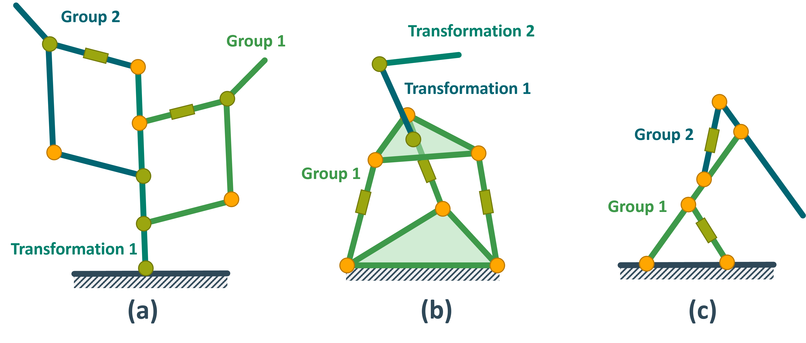
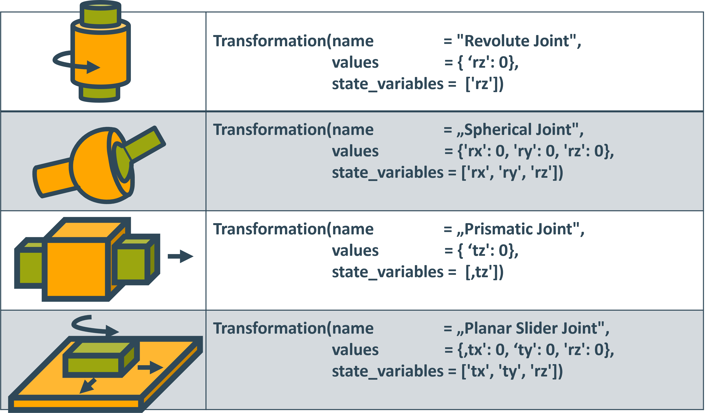
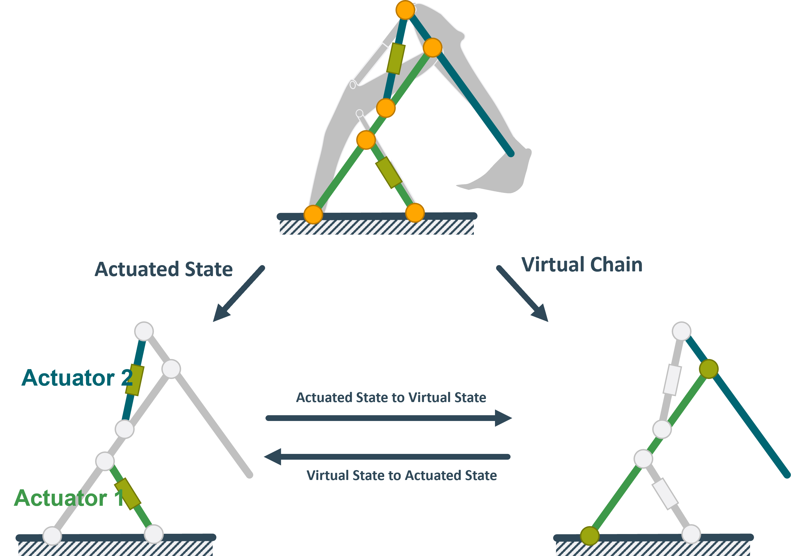

# Summary

​Robotics literature and practice have long been dominated by two types of mechanisms.
When a large workspace is required serial or branching manipulators are used.
If structural strength and high stiffness are instead required parallel robots are used.

However, sometimes both a large workspace and structural strength are required.
This can commonly be seen in 3d printed robots that rely on weaker actuators and don't employ gear trains.
According to @survey both requirements can be satisfied using hybrids between serial and parallel mechanisms.

​The price to be paid for these improvements is often modeling complexity.
​Finding an explicit solution for the inverse or forward kinematics is often impossible.

Using numerical approaches instead leads to complicated constrained optimization problems. ​

It has been shown by ​@​kumar​ that most robotics frameworks are not equipped to solve these problems for parallel robots let alone hybrid robots.
​TriP is a python package designed to close this gap using a modular modeling framework akin to the one described by ​@survey​ .
​It allows the modeling of arbitrary kinematic topologies and is capable of calculating forward and inverse kinematics.

The calculations are performed using a symbolic framework.
This makes it easy for users to implement custom case-dependent mathematical solvers.

# Statement of Need

​While a huge number of researchers use hybrid serial-parallel systems such as ​@PISLA​, ​@verne​ or ​@​berkley
​most robotics frameworks such as openrave ​@openrave​  or the Matlab robotics toolbox ​@​matlabrobot​ only support kinematic calculations for serial or branching manipulators.
​Frameworks that do support inverse kinematics calculations for parallel or hybrid mechanisms, like copeliasim ​@coppeliaSim​ , are often commercial products.
​This leaves developers to either shoehorn their hybrid robots into a framework not designed to handle them or be left to implement their own kinematic solvers.
​Especially during rapid prototyping, both can be tedious and time-consuming.

​TriP is a lightweight and easy-to-use package designed to simplify this process by directly modeling hybrid mechanisms and calculating their kinematics.
​It is thus primarily aimed at researchers and engineers who quickly want to build kinematic models in order to test their mechanical designs.

# Overview

​TriP models robots using its Robot class.
​A Robot object is made up of Transformation and KinematicGroup objects. The KinematicGroup objects are used to model parallel-kinematics while the Transformation objects model serial kinematic. See Figure ​\r​ef{hybrid_chain_taxonomy_groups} for reference. Here the links of each robot are colored according to the group or transformation it belongs to.
​
As seen in Figure \ref{hybrid_chain_taxonomy_groups} both groups and transformations can be connected to form branching mechanisms.

​Transformations can be either dynamic or static with dynamic transformations implementing joints.
​A few example joints can be seen in Figure ​\r​ef{sample_trafo} .
​
While all example joints use Euler angles in roll pitch yaw convention for rotation, quaternions are also supported.

​Groups model parallel mechanisms using the abstraction approach described by  ​@survey​ .
​It models a parallel manipulator as a virtual serial manipulator whose virtual joint state can be mapped to the true actuated joint state of the parallel manipulator.
An illustrative example of this model is an excavator with two hydraulic cylinders.
Each cylinder is part of a parallel mechanism resulting in two groups. Both can be seen in Figure ​\r​ef{group_structure}
​where one is green and the other one is blue.
​
the abstraction approach models the excavator as an serial manipulator where the joints are directly actuated.
Using two mappings to convert the state of the hydraulic cylinders to the state of the joints and vise versa it is possible to calculate both forward and inverse kinematics.
​In this example, the mapping between cylinders and joints can be expressed using trigonometry.
Since an explicit formulation of the mappings might not always be possible TriP can also compute the mapping by solving the closure equation of the parallel manipulator.

TriP can generate symbolic representations of robots using casadi ​@​casadi .
​This symbolic representation can be used to set up a solver object that then solves the inverse kinematics.
​While the library already implements a simple inverse kinematics solver the symbolic representation makes it easy to implement custom solvers.
​All features of TriP are thoroughly documented with tutorials and examples to help people get started.

# References